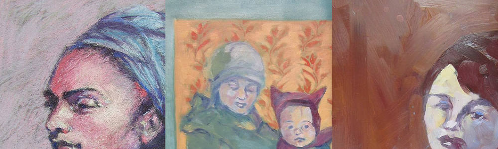
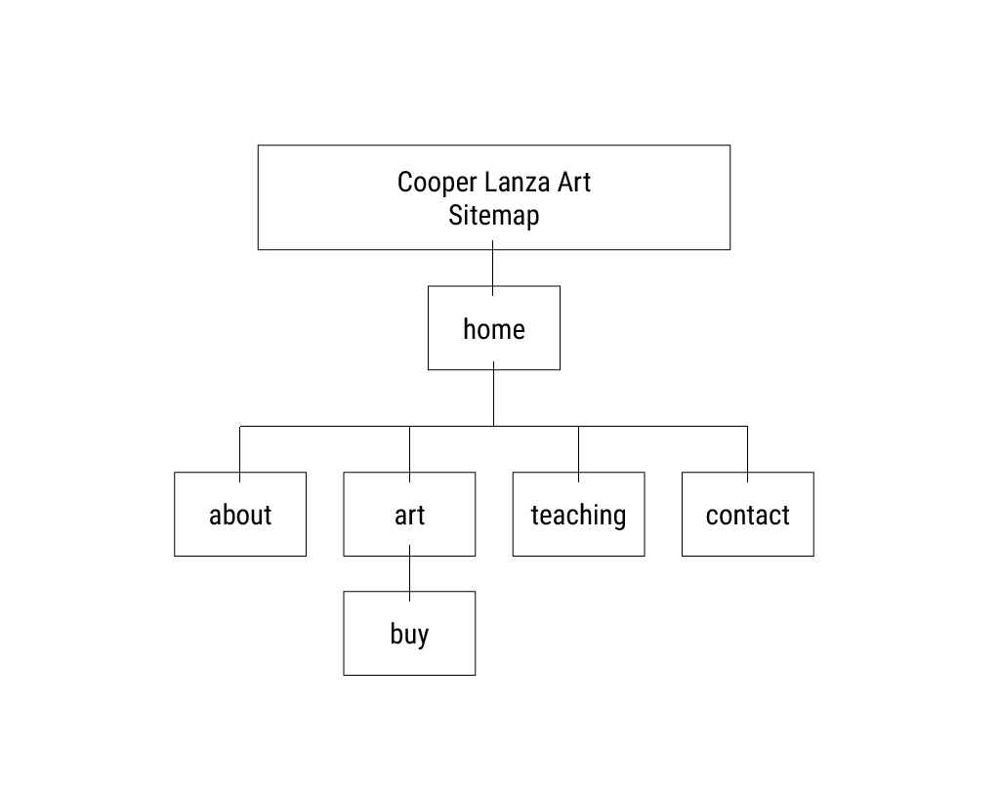
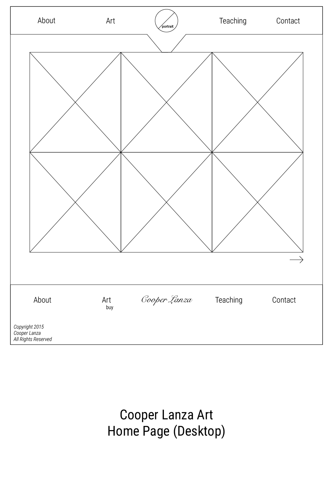
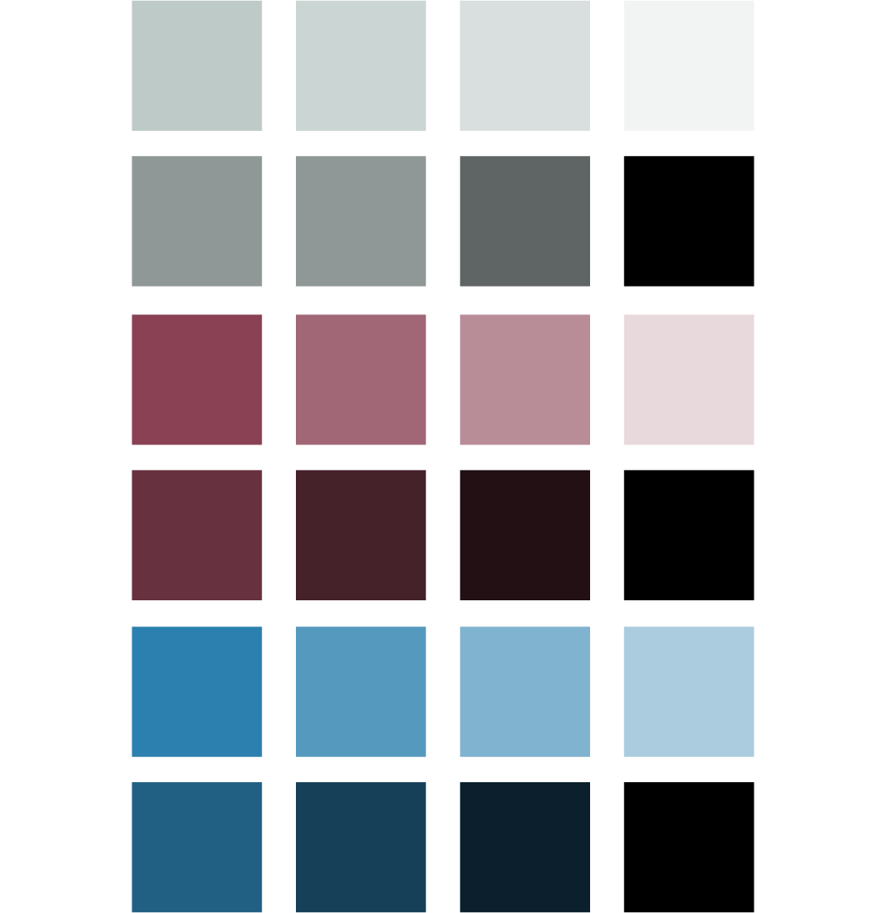
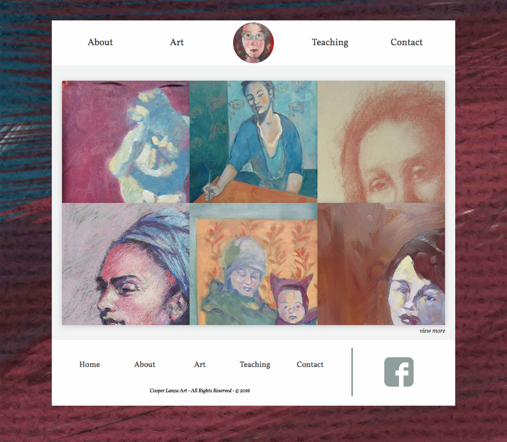
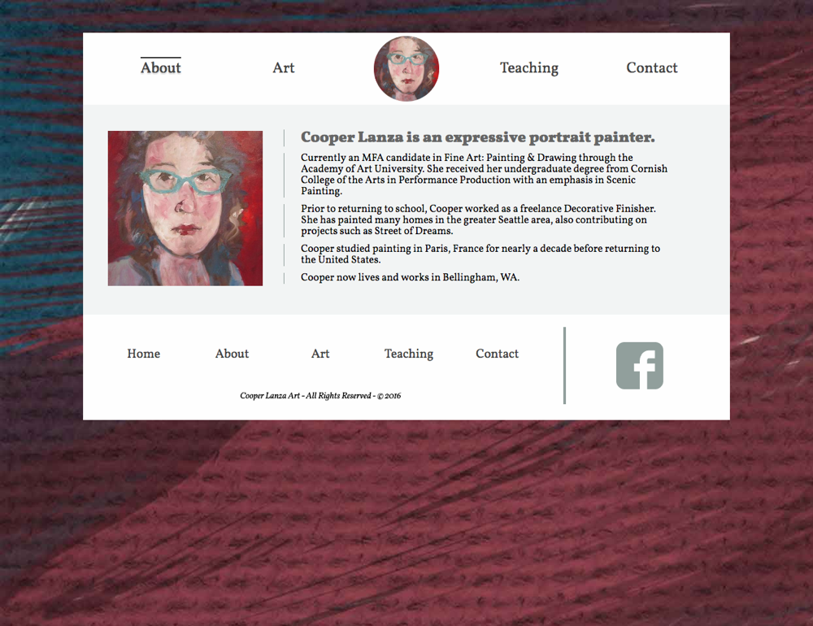
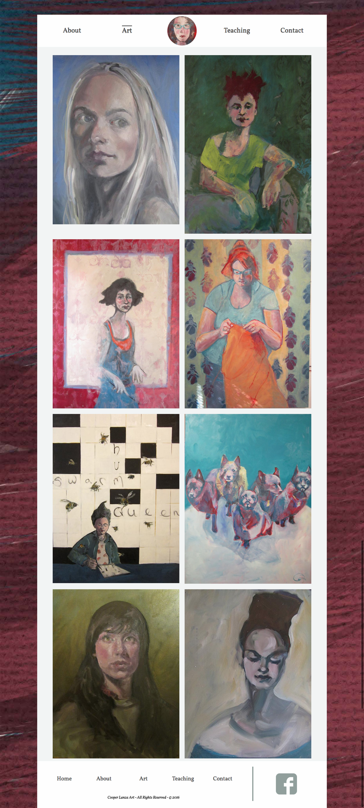
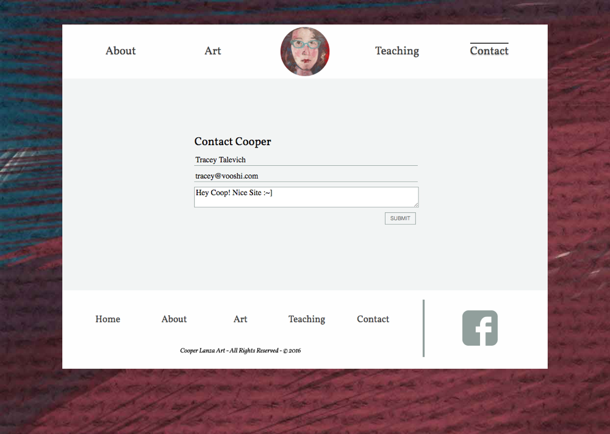

{:para: .center-p .medium-centered .medium-9 .small-12 .large-7}
Cooper Lanza is an expressive portrait painter.
{: para}

Cooper is a long time friend of mine and needed a website to reflect her talents as an artist.
{: para}

{:img-wide: .small-12 .img-wide}

{: img-wide}

{:h3: .center-h3 .medium-centered .medium-9 .small-12 .large-7}

### Who is Cooper?
{: h3}

An MFA graduate in Fine Art: Painting & Drawing through the Academy of Art University. She received her undergraduate degree from Cornish College of the Arts in Performance Production with an emphasis in Scenic Painting. 
{: para}

Cooper now lives and works in Bellingham, WA.
{: para}

### Site Requirements
{: h3}

* Design suited for an artist
* Artwork shown
* Contact Page
{: para}

Simple enough, right?
{:para}

{: img-wide}

### Wireframes
{: h3}

I won't lie -- this section is a a little bland, I mean they're (very simple) wireframes, what else would you expect?
{: para}

[Skip to final outcome.](#final)
{: para}

{: img-wide}

{: img-wide}

{: img-wide}

{: img-wide}

{: img-wide}

{: img-wide}

{:h3f: .center-h3 .medium-centered .medium-9 .small-12 .large-7 #final}

### Conclusion &amp; Final Outcome
{: h3f}

Cooper Lanza Art was one of my earlier projects and required me to really *think like and artist*. The background-image is something I made in Photoshop [(Here's a giant 3000x3000 wallpaper verson!)](img/lanza-bg-wallpaper.png){:target="_blank"}
{: para}

Overall -- I'm still happy with the outcome, I feel it conveys the langauge of a professional oil painter through pixels. There are things I would change now and redo (such as the mobile design) but overall I'm rather happy. Plus I still use the wallpaper on all of my devices.
{: para}

If you'd like to chat about your next project: [send me an email.](mailto:traceytalevich@gmail.com?subject=Project inquiry from Vooshi){:target="_blank"}
{: para}

[And here you can poke around the site as you wish](http://tracey.pw/web120/final/){:target="_blank"}
{:para}

{: img-wide}

{: img-wide}

{: img-wide}

{: img-wide}
