{:para: .center-p .medium-centered .medium-9 .small-12 .large-7}
Located in Panama, Floresta seeks to build a housing construct with a strong sense of community.
{: para}

With this vague-ish project goal in mind - I set foot in branding Floresta. 
{: para}
 
{:img-wide: .small-centered .small-12 .img-wide}
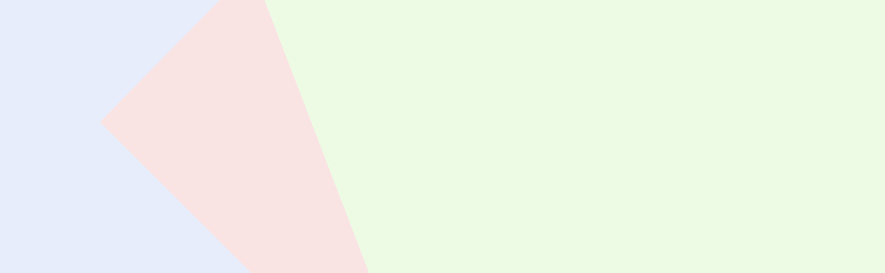
{: img-wide}

{:h3: .center-h3 .medium-centered .medium-9 .small-12 .large-7}

### Logo Design
{: h3}

First stop - logo design. A logo is one of the most important aspects of branding. Okay, probably *the* most important. 
{: para}

I asked myself a set of questions to get the braincells churning:
{: para}

* Location. What is recognizable and relatable to it's habitants 
* Where will the logo be shown? The side of a billboard? Business cards? On a plaque adorned to a gold encrusted statue?
* Content. Should there be a symbol? Name written out? 
{: para}

Taking each question into consideration (and not taking this writeup into consideration at the time); I ended up with the logo below. 
{: para}

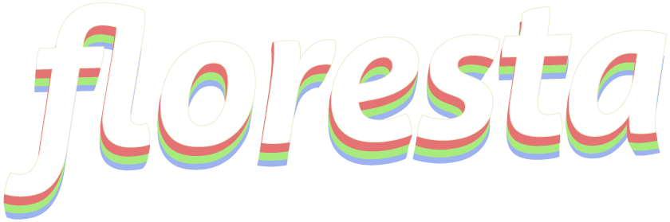
{: img-wide}

Just kidding, I found two more older renditions.
{:para}

{:img-double: .small-6 .img-double }
{: width="400px" data-featherlight="img/red-logo.png"}
{: img-double}
{: width="400px" data-featherlight="img/leaf-logo.png"}
{: img-double}

Whoa, 3 colors? [Are you crazy, are you outta your mind?!](https://www.youtube.com/watch?v=_x8e8QwPofc){: target="_blank"} Yes I chose three colors. These three colors have some significance to the region, well, maybe not great significance but significance nonetheless.
{: para .clearfix}

If you've ever been to Latin American, you'd know it's full of stucco finished buildings usually painted in a sun-faded redish pinkish shade. Sometimes there's blue ones, and I imagine green ones, okay, when not painted white. All painted in this once vibrant; now sun faded color scheme. It's beautiful.
{: para} 

### Information Architecture
{: h3}

Information Architecture
 : The organization of a website as it relates to usability and functionality. 
{: para}

I always create an information architecture for any project. I don't *poof\* these site layouts out of nowhere, y'know.
{: para}

To start, I will write questions which a potential site user may ask -- e.g 'What activities can I partake in' or simple ones like 'Where's the location?'. These questions then get sorted into categories containing similar subject matter.From that comes naming the categories ans sub-categories of which the questions fit best in. I may make a blog post on this process in the future. Remind me!
{: para} 

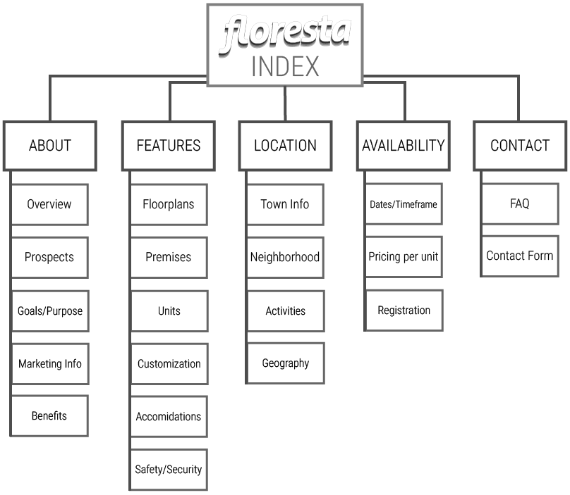{: data-featherlight="img/ia.png"}
{: img-wide}

### Wireframes
{: h3}

Our favorite section! Referencing the information architecture, wireframes were created to provide a baseline layout to which I would adhere* my visual design studies to.
{: para}

*used lightly in the case of this project
{: para .tooltip}

{:img-triple: .columns .small-4}
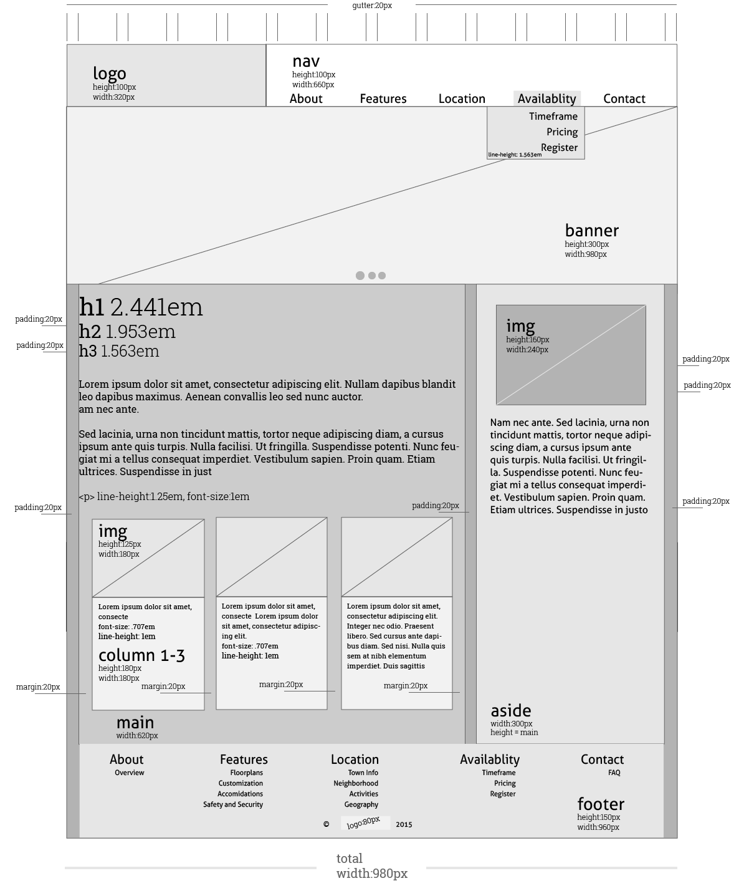{: data-featherlight="img/wf-home.png"}
{: img-triple}

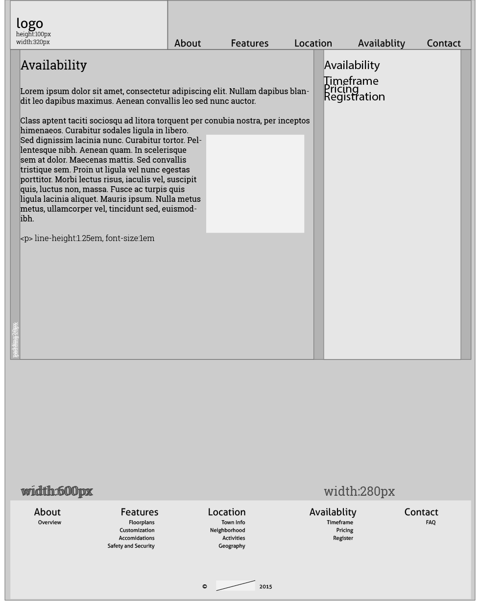{: data-featherlight="img/wf-inner.png"}
{: img-triple}

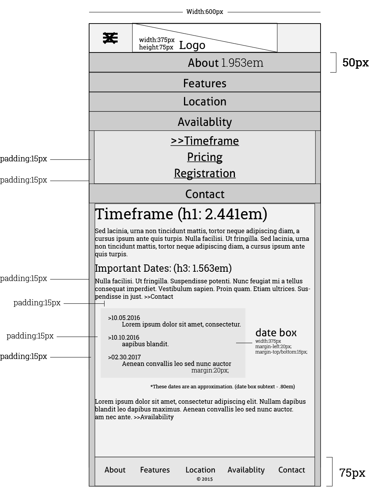{: data-featherlight="img/wf-mob.png"}
{: img-triple}

### Visual Design
{: h3}

Once my wireframes are approved, the visual design study process begins. Usually, I will create 3 separate designs swapping out typefaces, colors, and minor layout changes in some cases.
{: para}

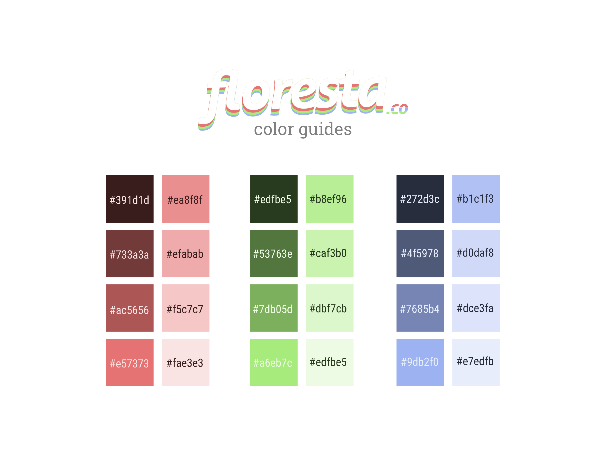{: data-featherlight="img/vis/colorguide.png"}
{: img-wide}

### Design one 
{: .clearfix}
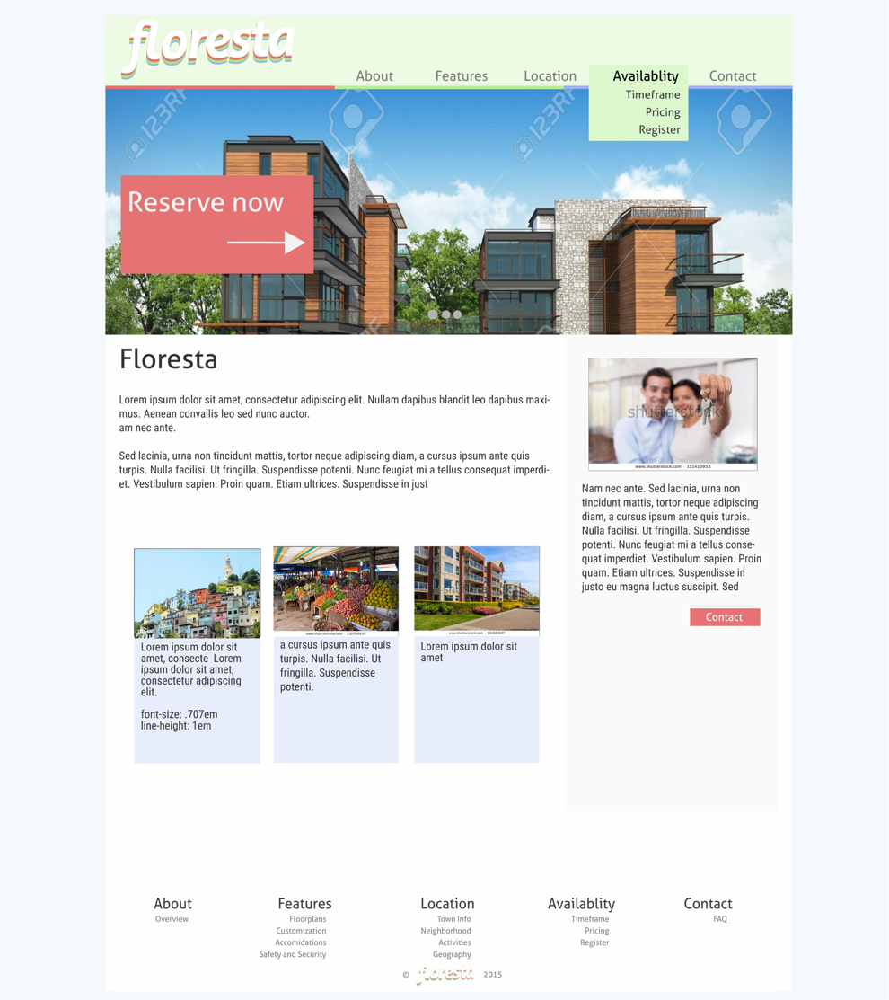{: width="460px" data-featherlight="img/vis/home-1.png"}
{: img-double}
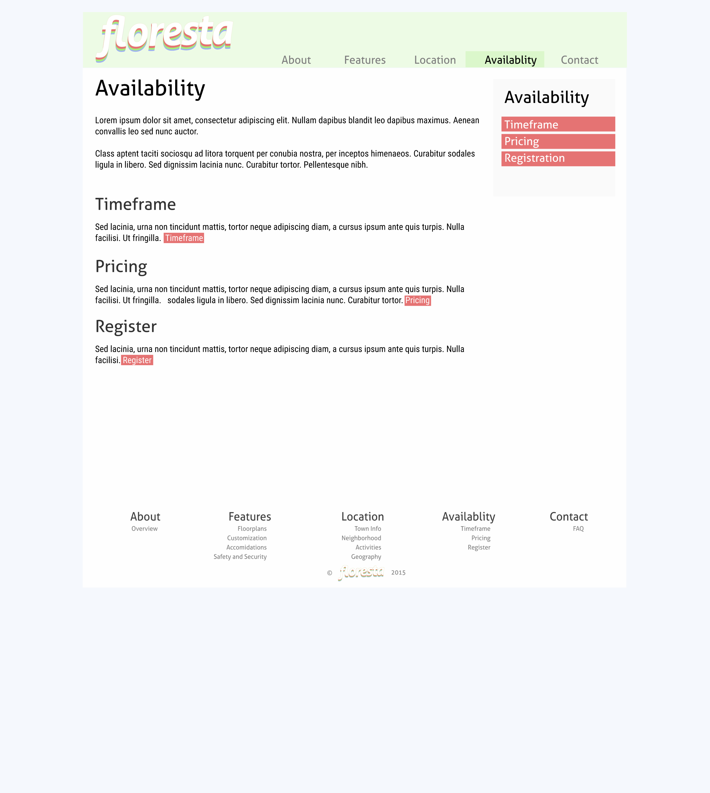{: width="460px" data-featherlight="img/vis/main-1.png"}
{: img-double}

### Design two 
{: .clearfix}
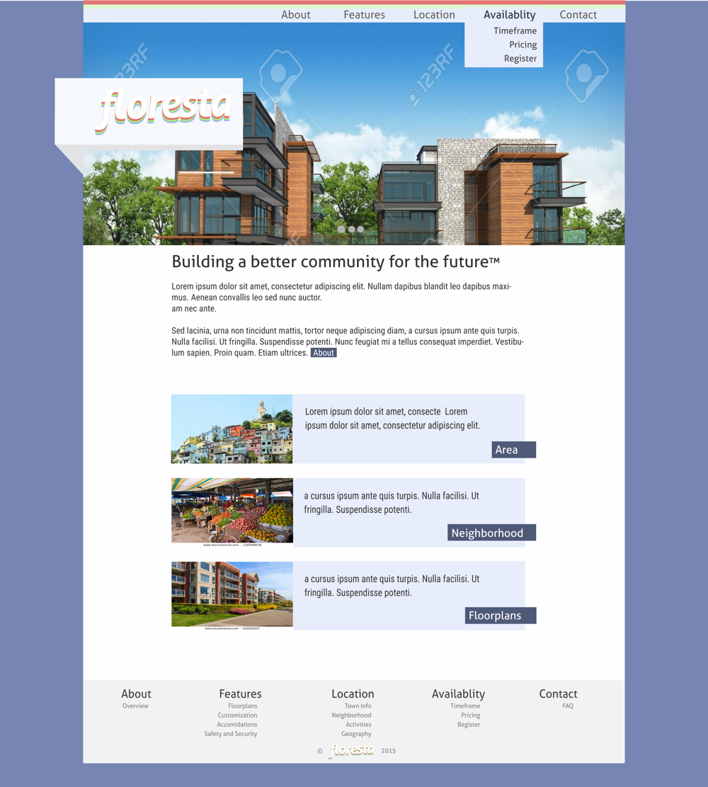{: width="460px" data-featherlight="img/vis/home-2.png"}
{: img-double}
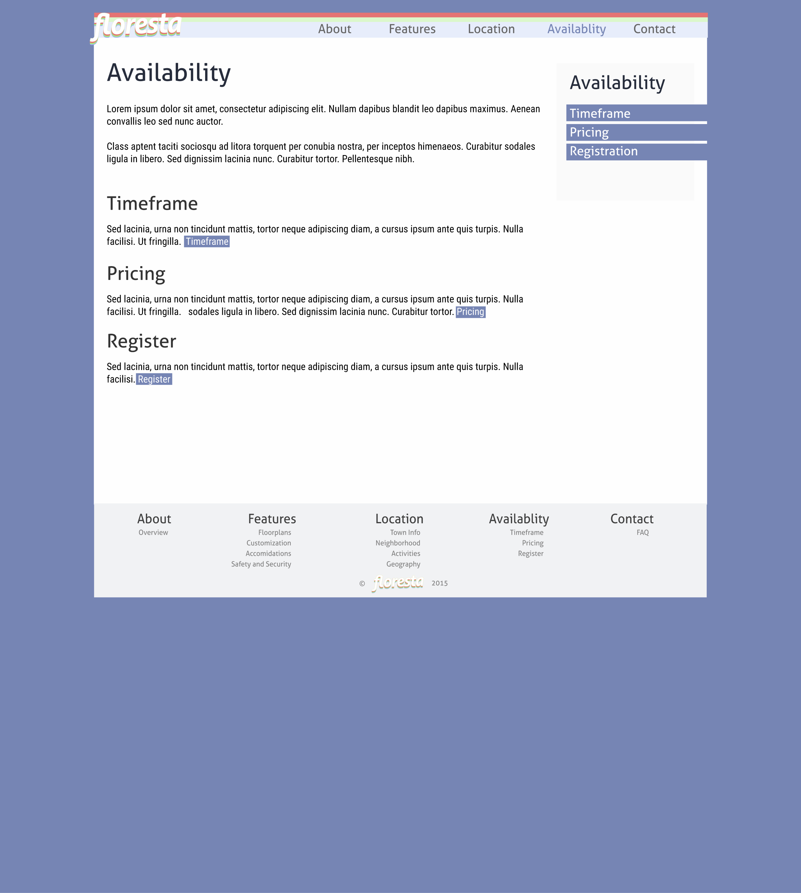{: width="460px" data-featherlight="img/vis/main-2.png"}
{: img-double}

### Design three 
{: .clearfix}

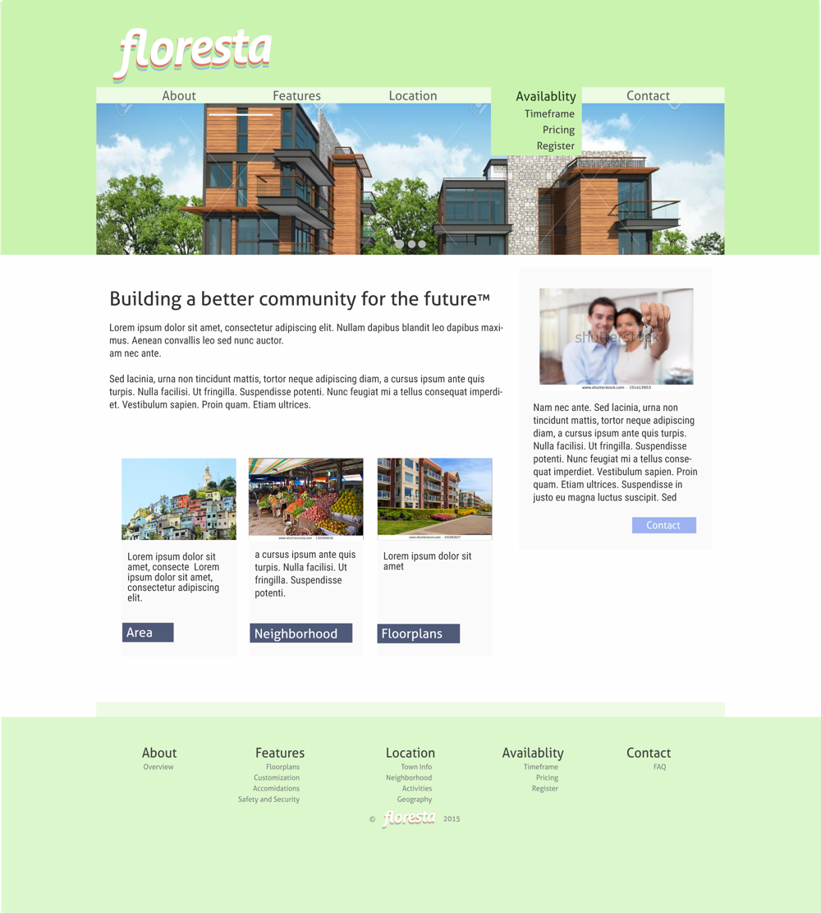{: width="460px" data-featherlight="img/vis/home-3.png"}
{: img-double}
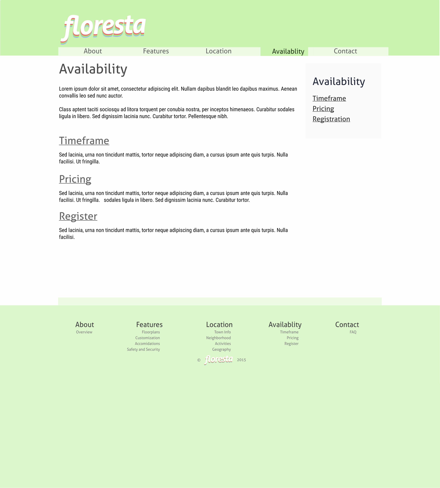{: width="460px" data-featherlight="img/vis/main-3.png"}
{: img-double}

### Final conclusions
{:h3}

Out of the three designs created. I felt that number two was the most visually apealling and provided the best usability. At that point in time, I was sick of sidebars. In fact, I'm still sick of sidebar navigation on home pages.
{: para}

As always, feel free to poke around the [project staging area](http://tracey.pw/web200/staging.html){: target="_blank"} to get a more in-depth view of my process as well as to see the [protosite](http://tracey.pw/web200/protosite/){: target="_blank"}
{: para}

