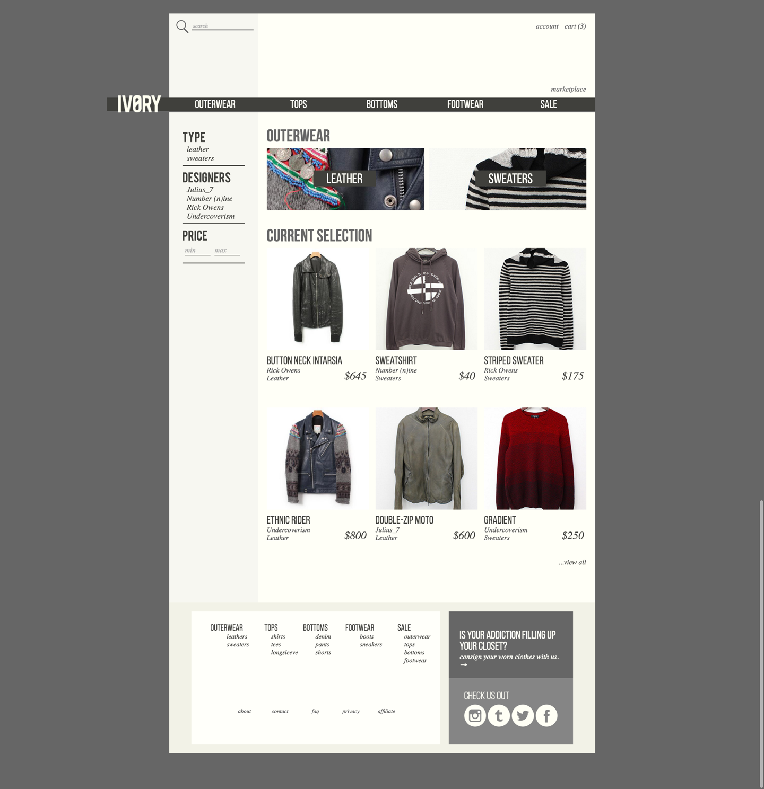

{:para: .center-p .medium-centered .medium-9 .small-12 .large-7}
Ivory is an online shop for men’s designer clothing. Visitors will be able to buy brand-new clothes, consign their clothing through us, or independently sell on our marketplace for a small fee.
{: para}

{:img-wide: .small-12 .img-wide}

{: img-wide}

{:h3: .center-h3 .medium-centered .medium-9 .small-12 .large-7}

### Brand Identity
{: h3}

Ivory stocks labels such as ‘Undercover(ism)’ and ‘Rick Owens’ pertaining to a somewhat bleak aesthetic.
{: para}

These aesthetic styles heavily influenced the design and color theory behind the site, whilst pertaining to a relatable online shopping experience.
{: para}

### Success Metrics
{: h3}

* Sales through main shop
* Profit from consigned clothes
* Profit earned from user marketplace sales
{: para}

{:img-double: .small-6 .img-double}

{: img-double}

{: img-double}

### Functional Specifications
{: h3}

Ivory will have a simple & clean design, with the color palette revolving around an ivory monotone.
{: para}

No excess information will be displayed (such as a newsletter sign-up alert). Ivory will feature the core aspects of a web shopping experience and refine them into perfection.
{: para}

Ivory will be responsive - meaning the site will provide the best user experience based on their device (e.g. smartphone, tablet, desktop), without losing the site’s signature branding.
{: para}

### User Profiles
{: h3}

{:tip: .tip .medium-centered .medium-9 .small-12 .large-7}
User profiling is used to determine your most-likely market to cater your services to.
{: tip}

**Example:** Yosij is a second year student attending a small Norwegian university with a focus on a degree in Ecology. He works part-time as a worker in a warehouse for a auto paint company, pulling orders and shipping them to customers. His job pays decently, since he’s still a dependent and doesn’t pay for everything himself. 
{: para}

*Please visit the [Staging Area](http://tracey.pw/web202/) for more in-depth examples*
{: para}

### Information Architecture &amp; Iteraction Design
{: h3}

{: img-wide}

{: img-wide}

### Conclusion &amp; Final Outcome
{: h3}

Ivory was an important project for me. Not only because I am proud of my work, but because the subject matter was of importance to me. Designer clothing is one of my favorite things, and having free-reign to create my dream clothing site was very enjoyable. 
{: para}

Feel free to poke around the [Project Staging Area](http://tracey.pw/web202/) for more in-depth examples. If you'd like to chat about your next project: [send me an email.](mailto:traceytalevich@gmail.com?subject=Project inquiry from Vooshi)
{: para}

{:img-wide: .small-12 .img-wide}

{: img-wide}

Anyone want to help make this company a reality? Anyways, here's the final result:
{: para}

{: img-wide}

{: img-wide}

{: img-wide}

{: img-wide}

{: img-double}

{: img-double}

{: img-double}

{: img-double}

