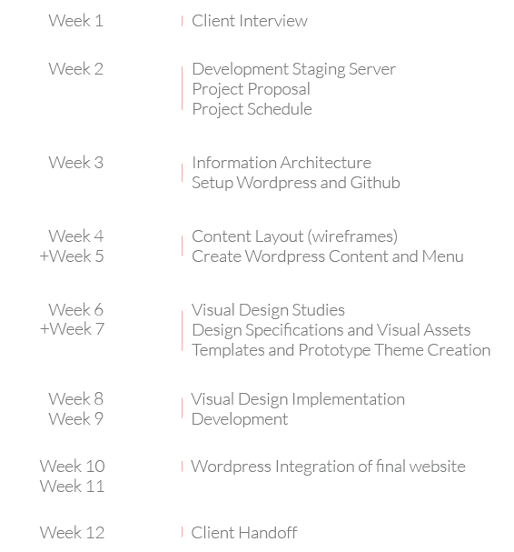
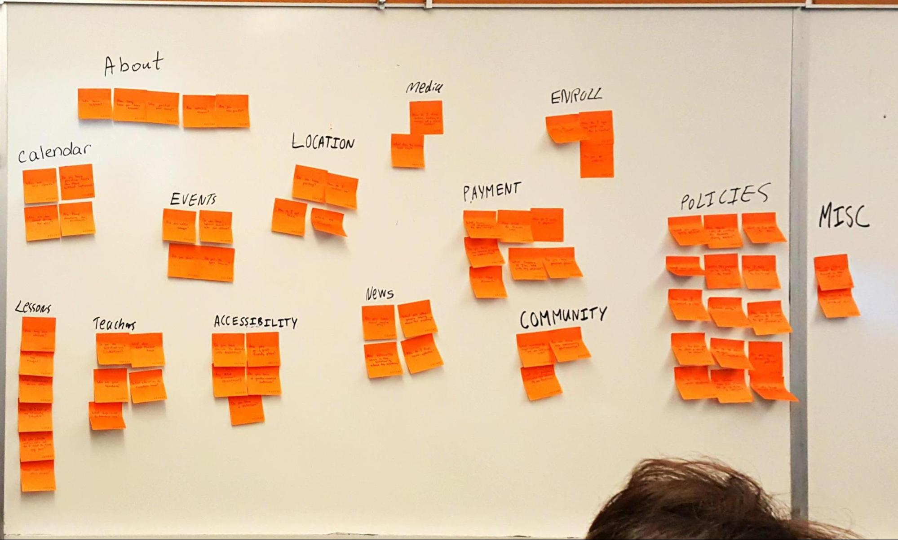
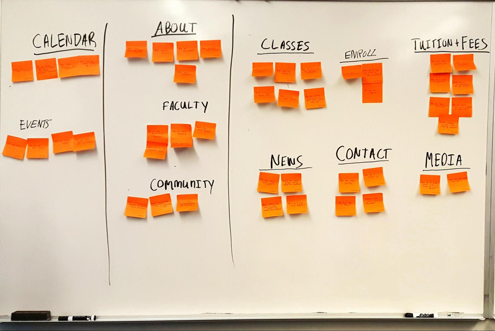
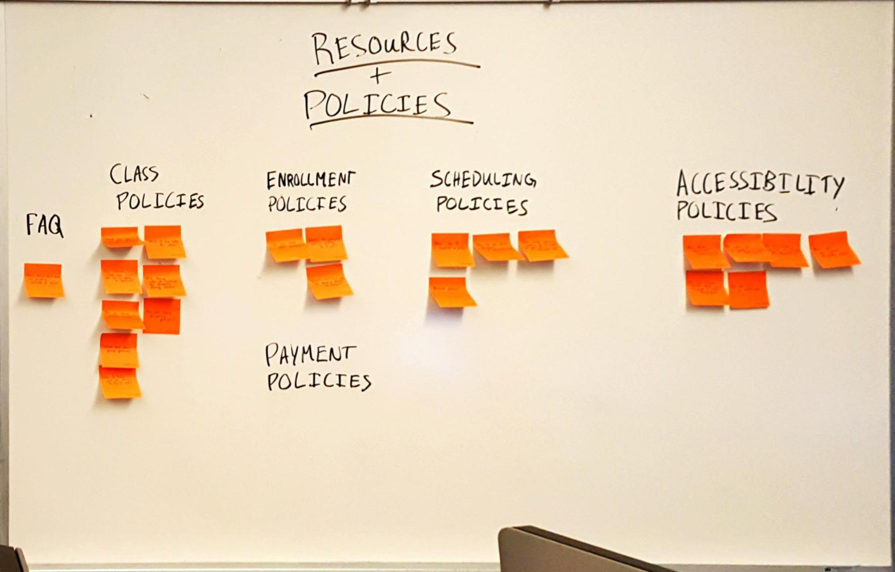
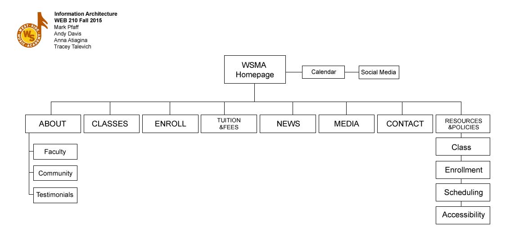
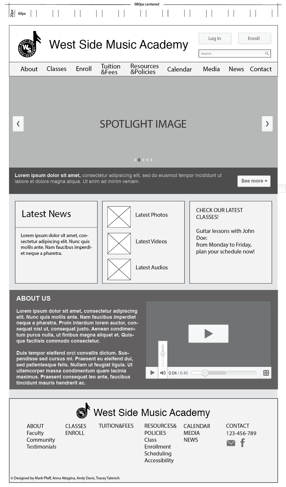
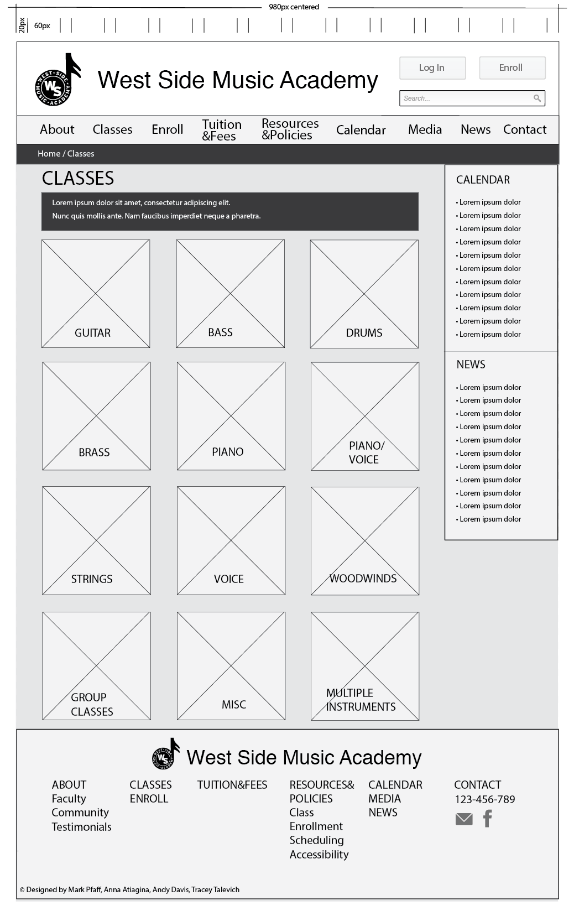
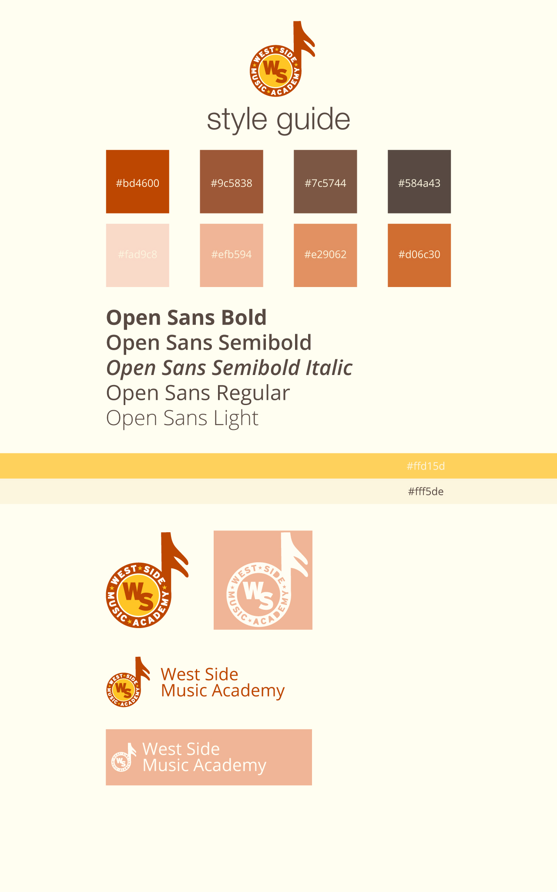
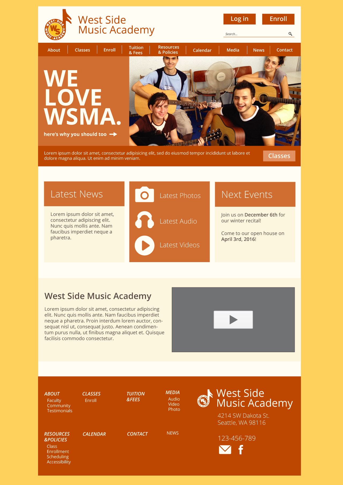
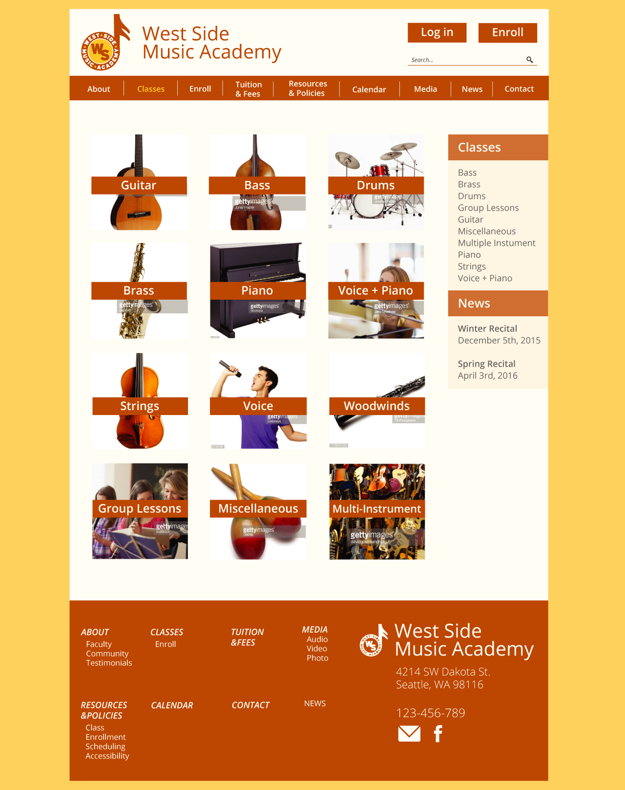

{:para: .center-p .medium-centered .medium-9 .small-12 .large-7}
West Side Music Academy is a Seattle-based school offering lessons for multiple instruments taught by various instructors.
{: para}

I was apart of the design team and had no hand in the actual development aside from logging issues on [Github](https://github.com/markpfaff/WSMA/wiki){: target="_blank"}. Although the client did not select my designs as their choice - I will specifically show my work for this project. 
{: para}
 
 

{:img-wide: .small-12 .img-wide}

{: img-wide}

{:h3: .center-h3 .medium-centered .medium-9 .small-12 .large-7}

### Timeline
{: h3}

We were working with a strict 12-week timeline for this project which forced us to get things done and signed off on by our clients (who were great, I should mention!)
{: para}

{: data-featherlight="img/timeline.png"}
{: para}

Below will be the process of discovery. If you just want pretty pictures and don't care about the client -- [click here.](#final) But really, it's worth a lookover to see our process used!
{: para}

### Client Interview &amp; Project Proposal
{: h3}

Here is the [client interview](https://docs.google.com/document/d/1ZxAzaHHiDADm0Ye0HXJrdxPgf-8ZpK0BnzlkHbWWyh8/edit?usp=sharing){: target="_blank"} and the [project proposal](https://drive.google.com/file/d/0B_mbS-PgkOeheXF6ZEl0RlBuTTQ/view){: target="_blank"} (if you're into that kind of stuff).
{: para}

{: img-wide}

### Information Architecture
{: h3}

Information Architecture
 : The organization of a website as it relates to usability and functionality. 
{: para}

The current website of West Side Music Academy (WSMA), westsidemusicacademy.com, relies on multiple navigation items which may or may not contain what the user is seeking. 
{: para}

In order to fulfill the user/customer’s ‘mental model’ of how a website should be organized, we took the means necessary to rearrange, remove, and combine the information available into a logical navigation scheme. 
{: para}

**TL;DR** --- We made the navigation better by attempting to fulfull the 'mental model' of the sites target user.
{: para}

### Information Architecture Process
{: h3}

After meeting with Chris and Cami MacDonald of West Side Music Academy, we had a better understanding of what current content needed kept, and desired areas for future content to be created. 
{: para}

{:img-wide-lb: .small-12 .img-wide .lb}

{: data-featherlight="img/whiteboard-1.jpg"}
{: img-wide-lb}

With this in mind, as a group, we formulated questions that a user visiting the site may seek the answer for. The questions were then written on sticky-notes and arranged in clusters contains similar subject matter. 
{: para}

These clusters were then refined and confined to their respective categories and sub-categories
{: para}

{: data-featherlight="img/whiteboard-3.jpg"}
{: img-wide-lb}

{: data-featherlight="img/whiteboard-2.jpg"}
{: img-wide-lb}

### Concluding Information Architecture Discovery
{: h3}

Arranging these notes helped us formulate a user-friendly navigation and information architecture using a ‘bottom-up’ approach. Allowing us to further refine our diagram to brainstorm ideal titles for the navigation, categories, and their respective content of the WSMA website. 
{: para}

With that in place, we came to a final conclusion for the Information Architecture of WSMA. The Information Architecture will be implemented as the final website’s layout. 
{: para}

{: data-featherlight="img/info-arch.jpg"}
{: img-wide-lb}

Next stop -- wireframes, woohoo! You're excited too, right?
{: para}

### Wireframes 
{: h3}

With the information architecture in place, we set off on the wirefames. I did the desktop version; so that's what is shown below. [Mobile wireframes here.](https://github.com/markpfaff/WSMA/wiki/Mobile-Wireframes){: target="_blank"}
{: para}

{: data-featherlight="img/wf-home.png"}
{: img-wide-lb}

{: data-featherlight="img/wf-gateway.png"}
{: img-wide-lb}

{:h3f: .center-h3 .medium-centered .medium-9 .small-12 .large-7 #final}

### Visual Design
{: h3f}

I kept these key points in mind as I set forth with the visual design stage
{: para}
* Ground-up Redesign of previous website
* Friendly & playful color palette to appeal to target audience
* Navagation scheme restructured logically
{: para}

{: data-featherlight="img/colorguide.jpg"}
{: img-wide-lb}

{: data-featherlight="img/home.jpg"}
{: img-wide-lb}

{: data-featherlight="img/inner.jpg"}
{: img-wide-lb}

### Conclusion &amp; Final Outcome
{: h3}

As stated before -- the client did *not* chose my work to implement. Although (to toot my own horn), they stated it looked the most professional! [Here's the finalized site](http://home.westsidemusicacademy.com/2015/){: target="_blank"} if you would like to compare the final results with my work.
{: para}

If you'd like to chat about your next project: [send me an email.](https://vooshi.com/contact/) I'm happy to chat whenever and about whatever (not literally -- use it to send me project inquiries or videos of ducks)
{: para}

